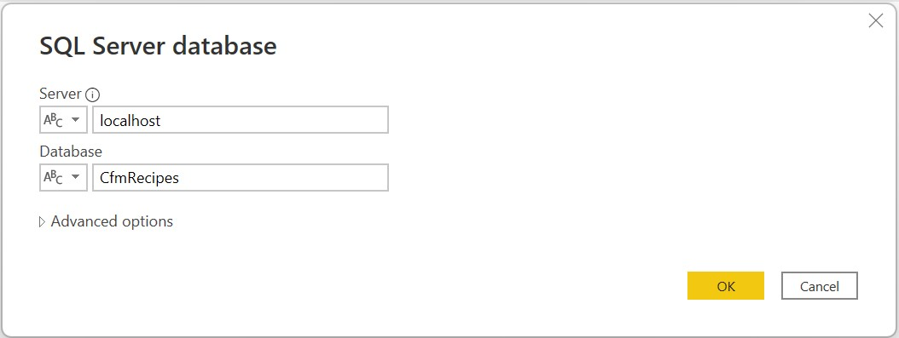
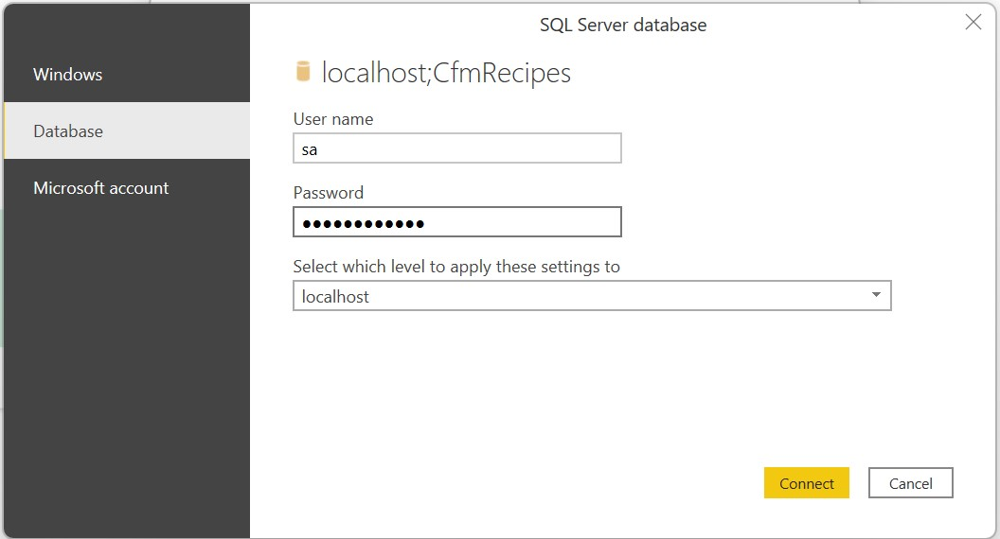

# Cloud Financial Management Recipes

Cloud Financial Recipes is a collection of reports built on top of a common dataset.

The Recipes include:

- Sample Reports
- [Common Data Sets](common_data_set/readme.md)
- [Development Environment](docs/developers.md)

## Quick Start

Get started looking at the sample recipe reports.

* Clone this project
* Create Sample Database
* Open the Sample Recipes Report Template

### Clone Project

```bash
# clone project
git clone https://github.com/Azure/Cloud-Financial-Management-Recipes.git

# Navigate to Recipes
cd Cloud-Financial-Management-Recipes
```

### Create Sample Database

There are two options to create a the sample databaes. 

* Docker Option
* SQL DACPAC Option

#### Docker Option

This option creates a local Sql database in a docker container and loads the database with sample data.

* Create an environment file
* Build the Common Data Docker Image
* Run the Database image

```bash
# Set Secrets in .env
SA_PASSWORD=ReplaceWithYourPassword
sed "s/<your password>/$SA_PASSWORD/" example.env > .env

# Build the image
docker build --pull --rm -f "database/Dockerfile.dev" -t cfm_recipes:latest "."

# Run a new Recipes container. This loads default data.
docker run --env-file .env -p 1433:1433 --hostname cfm_recipes --name cfm_recipes --detach cfm_recipes:latest
```

#### SQL DACPAC/BACPAC Option

Import the database using either the DACPAC or BACPAC file

```bash
server_name=localhost
database_name=CfmRecipes
database_user=sa
database_password='password used in setup'

# Publish the data-tier application (DAC). Schema, table data, user data, etc..
sqlpackage /Action:Publish /SourceFile:"./database/CfmRecipes.dacpac" /TargetConnectionString:"Server=tcp:$server_name,1433;Initial Catalog=$database_name;Persist Security Info=False;User ID=$database_user;Password=$database_password;MultipleActiveResultSets=False;Encrypt=True;TrustServerCertificate=False;Connection Timeout=30;"

# Import schema and table data from BACPAC
sqlpackage /Action:Import /SourceFile:"./database/CfmRecipes.bacpac" /TargetConnectionString:"Server=tcp:$server_name,1433;Initial Catalog=$database_name;Persist Security Info=False;User ID=$database_user;Password=$database_password;MultipleActiveResultSets=False;Encrypt=True;TrustServerCertificate=False;Connection Timeout=30;"
```

### Open Sample Report
Open the `./report/RecipesReport.pbit` file.

Fill in the information for the sample database:

- server: localhost
- database: CfmRecipes



Click `load`

Fill in the Username and password for the database connection
- sa
- `password used in setup`

 

## Contributing

This project welcomes contributions and suggestions. See the [Developer Docs](docs/developers.md) page to setup your environment for developing. Most contributions require you to agree to a
Contributor License Agreement (CLA) declaring that you have the right to, and actually do, grant us
the rights to use your contribution. For details, visit https://cla.opensource.microsoft.com.

When you submit a pull request, a CLA bot will automatically determine whether you need to provide
a CLA and decorate the PR appropriately (e.g., status check, comment). Simply follow the instructions
provided by the bot. You will only need to do this once across all repos using our CLA.

This project has adopted the [Microsoft Open Source Code of Conduct](https://opensource.microsoft.com/codeofconduct/).
For more information see the [Code of Conduct FAQ](https://opensource.microsoft.com/codeofconduct/faq/) or
contact [opencode@microsoft.com](mailto:opencode@microsoft.com) with any additional questions or comments.

## Trademarks

This project may contain trademarks or logos for projects, products, or services. Authorized use of Microsoft 
trademarks or logos is subject to and must follow 
[Microsoft's Trademark & Brand Guidelines](https://www.microsoft.com/en-us/legal/intellectualproperty/trademarks/usage/general).
Use of Microsoft trademarks or logos in modified versions of this project must not cause confusion or imply Microsoft sponsorship.
Any use of third-party trademarks or logos are subject to those third-party's policies.
