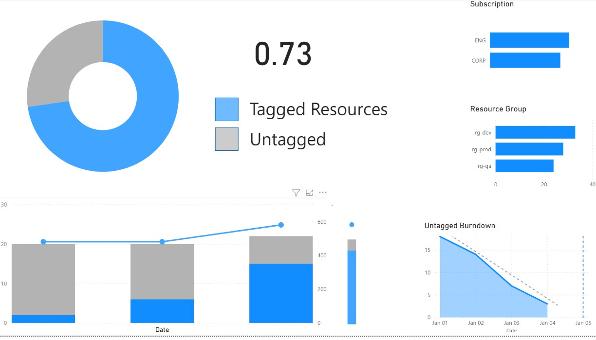

# Tagged Resources Recipe

* [Overview](#overview)
* [Schema](#schema)
* [Example Data](#example-data)
* [Source Data](#source-data)
* [Transformation](#transformation)

## Overview

Best Practice: As an organization, have 90% all resources tagged with standard tags.

### Sketch


### PowerBI


## Schema

Parameters may include:
* `target_tag` As the target to tag to check

**Single Table**
| Field | Type | Notes |
|-------|------|-------|
| date |   | |
| subscription_name |  | Filter  |
| subscription_id | nvarchar(100) | Filter |
| resource_group | nvarchar(100) | Filter |
| resource_name | nvarchar(100) | Filter |
| resource_id | nvarchar(100) | Filter |
| compliant_resource_count | | 1 if has_tag is True |
| non_compliant_resource_count | | 1 if has_tag is False |
| resource_count | | Always 1 | 
| has_tag | | True if it has the tag `target_tag`|
| is_forecast | | Forcasted data |
| is_latest | | Indicates the most recent data |
| is_optimal_forcast | | Indicates optimal forecast |
| cost | | |
| forecast_cost | | Calculated cost if record is_forecast=True and is_optimal_forecast=False |
| optimal_cost | | Calculated cost if record is_forecast=True and is_optimal_forecast=True |

**Multi Table**

## Example Data
See full dataset [sample_data.csv](sample_data.csv)

## Source Data

**SQL Query**
```sql

-- Set Parameters
DECLARE @previous_day date
DECLARE @target_tag [nvarchar](300)
SET @target_tag = <replace with target_tag>
SET @last_week = DATEADD(day, -7, convert(date, GETDATE()))
-- SET @last_week = DATETIMEFROMPARTS(2022, 1, 1, 0, 0, 0, 0); 

-- Get Resource Tag Compliance 
select  [Date] as [date]
	,[CostCenter] as [cost_center]
	,[SubscriptionId] as [subscription_id]
	,[SubscriptionName] as [subscription_name]
	,[ResourceGroup] as [resource_group]
	,[ConsumedService] as [consumed_service]
	,[MeterCategory] as [meter_category]
	,[MeterSubCategory] as [meter_sub_category]
	,[MeterName] as [meter_name]
	,[ProductName] as [product_name]
	,[PartNumber] as [part_number]
	,Sum([ResourceIdCount]) as [resource_id_count]
	,Sum(case when charindex(@target_tag, [Tags],0) > 0 then 1 else 0 end) as compliant_tag_resource_count
	,Sum([CostInBillingCurrency]) as cost
FROM [costmanagement].[ActualCostSummary]
WHERE Date = @last_week
Group By
	[Date]
	,[CostCenter]
	,[SubscriptionId]
	,[SubscriptionName]
	,[ResourceGroup]
	,[ConsumedService]
	,[MeterCategory]
	,[MeterSubCategory]
	,[MeterName]
	,[ProductName]
	,[PartNumber]
Order by  [Date]
	,[CostCenter]
	,[SubscriptionId]
	,[SubscriptionName]
	,[ResourceGroup]
	,[ConsumedService]
	,[MeterCategory]
	,[MeterSubCategory]
	,[MeterName]
	,[ProductName]
	,[PartNumber]
```

**Azure Graph API Query**
```kql
ResourceContainers 
| where type=='microsoft.resources/subscriptions' | project subscriptionId, subscription_name=name
| join kind=leftouter (Resources | project subscriptionId, resourceGroup, type, name, id, tags) on subscriptionId
| project subscription_id=subscriptionId, subscription_name, resource_group=resourceGroup, resource_type=type, resource_name=name, resource_id=id, tags
| extend tagkey = tostring(bag_keys(tags)[0])
| extend has_tag = (tagkey=='<target_tag>')
| summarize resource_count=count(), compliant_resource_count=count(has_tag), non_compliant_resource_count=count(not(has_tag)) by subscription_id, subscription_name, resource_group, resource_type
``` 

## Transformation

Transform the source by mapping to new format, apply steps in notes and sort by displayName.

[JMESPath](https://jmespath.org/) notation used to map to fields.

| Field | Source | Notes |
|-------|------|-------|


## Sample Data

Fetch data by calling the azure graph api and the `cli`.

```bash
# Set parameter for 
target_tag=<repalce with tag>

# Run Azure Resource Graph query
az graph query -q "ResourceContainers | where type=='microsoft.resources/subscriptions' | project subscriptionId, subscription_name=name | join kind=leftouter (Resources | project subscriptionId, resourceGroup, type, name, id, tags) on subscriptionId | project subscription_id=subscriptionId, subscription_name, resource_group=resourceGroup, resource_type=type, resource_name=name, resource_id=id, tags | extend tagkey = tostring(bag_keys(tags)[0]) | extend has_tag = (tagkey=='$target_tag') | summarize resource_count=count(), compliant_resource_count=count(has_tag), non_compliant_resource_count=count(not(has_tag)) by subscription_id, subscription_name, resource_group, resource_type"

```